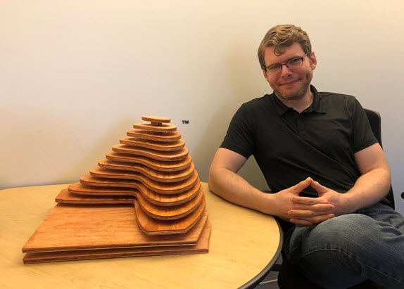
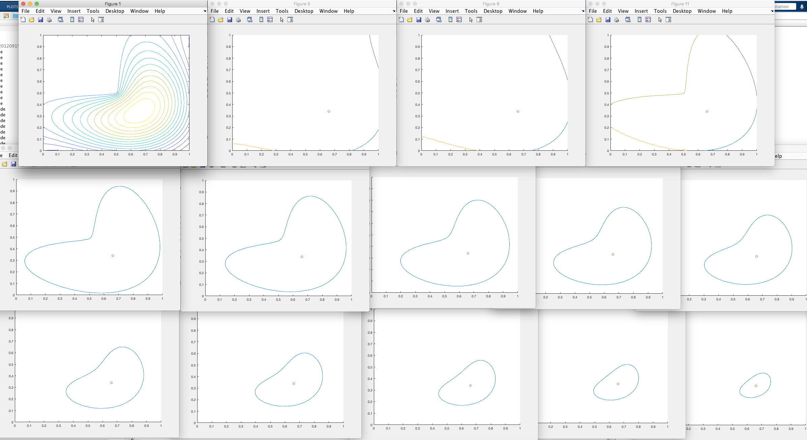
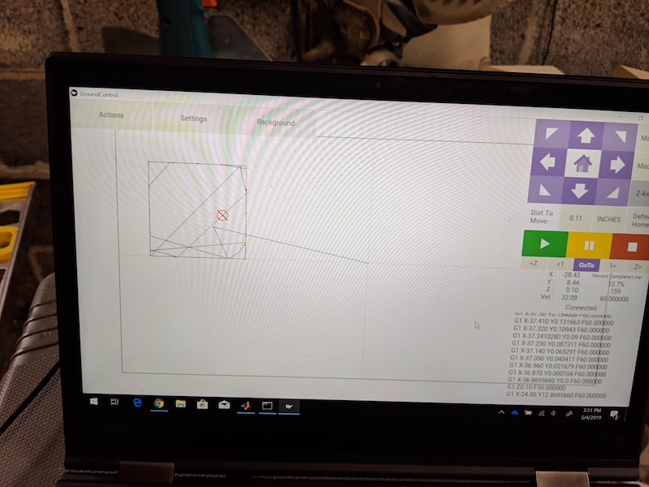
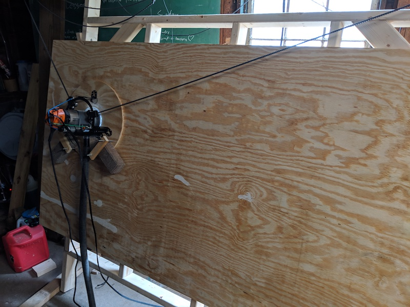
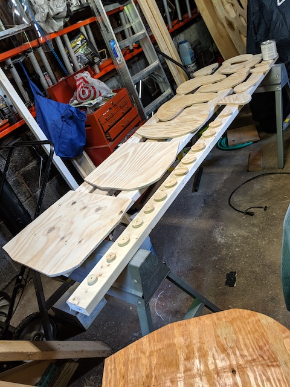
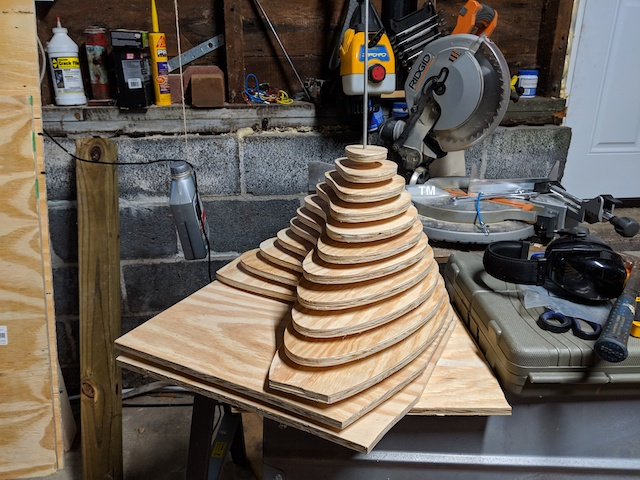
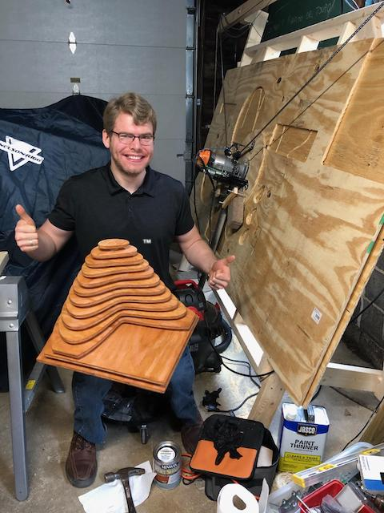
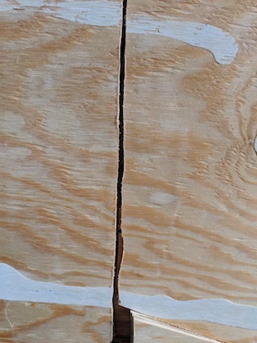
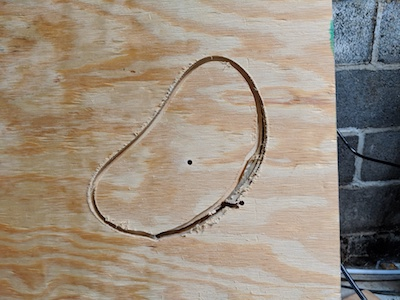

# The Plywood Membrane

This is a project for converting a mathematical plot in MATLAB® into G-code files for the
[Maslow CNC](https://www.maslowcnc.com/) to carve the plot out of wood.

The L-Shaped Membrane as depicted here is a registered trademark of [The MathWorks, Inc](https://www.mathworks.com/) and is used with permission. MATLAB and Simulink are registered trademarks of The MathWorks, Inc. See www.mathworks.com/trademarks for a list of additional trademarks.

Assumes:
* 1/2" plywood
* Fixed feed rates
* 4x8 material
* Offsets based on 18" to a side

Required:
* (1) 1/4" threaded rod
* (2) 1/4" T-nuts (in the base layer and the top spacer)
* (12) spacers cut with a hole saw



## Audience

The home hobbyist / maker interested both MATLAB® and the open source Maslow CNC system, who likes to get low level and personal with their plywood.

## Background

My wife and I are restoring a lovely folk victorian home from the mid to late 1800s, and needed a way to reproduce some of the templated woodwork easily and affordably. I stumbled across the [Maslow CNC system, a $500 open source upright home CNC machine](https://www.maslowcnc.com/) you assemble yourself, and there we found our solution! But what is CNC? How does it work? What is G code? These were all things I needed to learn. At the same time, as a web developer, my skills with MATLAB® were getting rusty…

Inspiration struck after reading [Paul Prints the L-Shaped Membrane](https://blogs.mathworks.com/community/2013/06/20/paul-prints-the-l-shaped-membrane/). Why not use MATLAB® to generate some G code, and pay tribute to [Cleve Moler's beautiful eigenfunction at the same time?](https://blogs.mathworks.com/cleve/2014/12/01/mathworks-logo-part-five-evolution-of-the-logo/) 

Brilliant!

### Your Mileage May Vary

It should be clear by now this was a weekend learning project. As I type this, I can see a dozen areas for improvement and optimization, which I will leave as an exercise for the reader. Bear this in mind when following the path forged here.

## Anatomy of the Code

The code below generates 13 layers for the Maslow to cut, divided into 13 G code files, each with a safe offset on a 4'x8'x0.5" sheet of material. This makes it easy to perform the cut incrementally, and self correct if (when) the unexpected happens, like forgetting to zero out the Z axis.

Three files are provided:

- memgenclean.m
  - The main function, run this to get your G code on.
- writegc.m
  - A helper function to take care of writing out files and generally [keep things DRY](https://en.wikipedia.org/wiki/Don%27t_repeat_yourself)
- contourLevels.m
  - A function to convert a contour matrix into cell arrays we can work with [(Thanks Ned!](https://www.mathworks.com/matlabcentral/profile/authors/140947-ned-gulley))

#### memgenclean.m

##### Setup

First we need a membrane. For that, MATLAB® provides an aptly named `membrane` function. We'll also get linear X and Y vectors for contouring.

```matlab
n = 100; % number of partitions in each dimension.
X = linspace(0,1,2*n+1);
Y = X;
Z = membrane(1,n);
```

Next, we get a contour map. In the first attempt, I used [boundary](https://www.mathworks.com/help/matlab/ref/boundary.html), but quickly ran into trouble balancing optimization to accuracy to aesthetics. There is a better way. It turns out MATLAB® again provides a fairly obvious function to do what I want:

```matlab
M = contour(X,Y,Z,15);
```

Here we provide our X, Y, and Z vectors and get back 15 contour levels. Later on we'll actually discard the lowest two layers to simplify the sculpture a hair.

However, a contour matrix is not the linear set of X and Y cell arrays boundary() had given me, which made G code plotting easier. The provided contourLevels solves nicely:

```matlab
% Convert contour map to XYZ vectors
[Xa, Ya, Za] = contourLevels(M);
```

I wanted each layer to be automatically placed on the plywood to minimize any manual orienting, so I created offset matrices. Later, I also added a boolean toggle in case I needed to recut a layer.

```matlab
final_w = 18; % Membrane size in inches
final_h = 18;
use_offsets = 1; % 0: Place all layers at 0x0, 1: arrange on 4x8'
frame = 0; 		% Used for file naming later

% Map offsets to a sheet of plywood, beginning at -42" (6" from the edge)
offsets = [];
for x = -42:18:30
    if use_offsets
        offsets = [offsets, [x x; 0 -18]]; % Arrange on a 4x8 sheet
    else
        offsets = [offsets, [0 0; 0 0]]; % Plot from 0x0
    end
end

if use_offsets
    offsets = [offsets, [3 18 24; -9 -9 -9]]; % Smaller pieces are manually placed between the larger
else
    offsets = [offsets, [0 0 0; 0 0 0]]; % Plot from 0x0
end

```

During the actual build, I ran into accuracy trouble at the lower far corners using the original chain tensioning system, described below in troubleshooting. Eliminating the offset meant I could manually position the router sled in a clear space on the material and cut the shape there. This is why breaking the project into multiple files is a good idea.

**Optimization opportunity:** This is very inflexible. It would be much better to use MATLAB® to automate placement and rotation. More on this in writegc() below.

##### The main loop

```matlab
k = 5;
while k <= length(Za)
```

Through manual trial and error, I determined I wanted to skip the first two contours. `contour`, and by extension `contourLevels`, introduces a new cell array for each part of a contour edge where it falls out of bounds. `k = 5` thus puts us at the start of the third layer (1 edge for the first layer, 3 for the second). This also means we'll need to compensate for multiple edges later when we want to cut a full contour.

Next, purely for visual troubleshooting, we initialize and configure a figure to plot on. We'll use a different plot for each contour level:

```matlab
    h = figure(k);
    xlim([0 1]);
    ylim([0 1]);
    hold on;
    plot(Xa{k}, Ya{k});
```

After some deliberation, I settled on a threaded rod to tension the layers together later. Since I was using a 1/4" router bit, I just need to add a point to drill. In an earlier version, I also had drill points at the corners.

```
    drills = {};
    drills = [drills, {[.66;.34]}];
    scatter(.66,.34);
```

We also want to plot extra edges and iterate `k` as needed. This is also a good time to simplify the layers to a cell array with each level isolated. I used the Z value to determine when we hit a new level.

```
    cuts = {};  
    cuts = [cuts, {[Xa{k};Ya{k}]}];
    oldZ = Za(k);
    k = k + 1;

    if k <= length(Za)
        while Za(k) == oldZ
            plot(Xa{k}, Ya{k});
            cuts = [cuts, {[Xa{k};Ya{k}]}];
            k = k + 1;
        end
    end

    hold off;
```

At this point, if you added `end` and run the `memgenclean`, you should get 13 figures that look something like this, with a combined figure in the top left:



Note the separate colors for the edges where the contour is broken. This makes for an interesting problem: if we cut these curves as is, the figures along the top row will not be complete. We need to add edges along the plot edges. Since later I'll use a lazy approach to adding tabs, I need to manually compute tab positions:

```matlab
    % Square outline cut for the partial contours
    if size(cuts,2) >= 3
        % Cut a full square
        cleanupLines = [cleanupLines, {[0 1 1 0 0; 0 0 1 1 0]}];

        % Generate box lines with evenly spaced extra large supporting tabs
        tabCount = 4;
        tabWidth = .03;

        for x = 0:tabCount:1-tabCount
            cleanupLinesTabs = [cleanupLinesTabs, {[x x+(1/tabCount)-tabWidth; 0 0]}];
        end
        for y = 0:tabCount:1-tabCount
            cleanupLinesTabs = [cleanupLinesTabs, {[1 1; y y+(1/tabCount)-tabWidth]}];
        end
        for x = 1-tabCount:-tabCount:0
            cleanupLinesTabs = [cleanupLinesTabs, {[x x+(1/tabCount)-tabWidth; 1 1]}];
        end
        for y = 1-tabCount:-tabCount:0
            cleanupLinesTabs = [cleanupLinesTabs, {[0 0; y y+(1/tabCount)-tabWidth]}];
        end
    end
```

At this point, we have two sets of cuts, `cleanupLines` and `cleanupLinesTabs`. Similar to when I cut the contours, I'll produce G code to cut `cleanupLines` down to .4" into the material, then switch to `cleanupLinesTabs` to cut a tabbed version of the border. **Tabs are critical to keeping the shape in place while the router moves along the surface.**

We're ready to write some data! Using [Maslow's G code reference](https://github.com/MaslowCNC/GroundControl/wiki/G-Code-and-MaslowCNC), and a lot of experimentation with the [G-Code Q'n'dirty toolpath simulator](https://nraynaud.github.io/webgcode/), prepare each file:

```matlab
    frame = frame + 1;

    fileID = fopen(sprintf('level-%d.nc',frame),'w');

    fprintf(fileID, "G20\n"); % Set to inches
    fprintf(fileID, "G1 Z0.10 F2\n"); % Elevate router to .1 inches at 2 inches per minute
```

Here is where we start using `writegc` described below, first to cut the drill holes. We only cut a partial hole on the top piece to hide the threaded rod we'll add later:

```matlab
    % Drill the bolt hole we'll use to tension levels together
    if frame < 13
        writegc(fileID, drills, 0, -0.60, offsets(1,frame), offsets(2,frame), final_h, final_w);
    else
        % On the top, leave a solid surface to conceal the threaded rod
        writegc(fileID, drills, 0, -0.40, offsets(1,frame), offsets(2,frame), final_h, final_w);
    end

```

The arguments here are:

writegc( ...

- File ID
- Cell array of linear cuts
- 0: Don't add tabs, 1: Add tabs at preset intervals
- Depth, -0.60 takes us safely through
- X offset
- Y offset
- Vertical scale
- Horizontal scale

In theory, this lets me change the size at will. With the offsets hardcoded, however, they will still be spaced 18 inches.

**Optimization opportunity:** This is an ideal place for optimization - MATLAB® can certainly handle shifting offsets and rotation to maximize material use, and would be a great start to a more general G code writer.

Next comes the most important part, cutting the contour curves. I divided it into four passes, cutting 0.15" deep each pass, and enabling tabs on the last one.

```matlab
    writegc(fileID, cuts, 0, -0.15, offsets(1,frame), offsets(2,frame), final_h, final_w);
    writegc(fileID, cuts, 0, -0.30, offsets(1,frame), offsets(2,frame), final_h, final_w);
    writegc(fileID, cuts, 0, -0.45, offsets(1,frame), offsets(2,frame), final_h, final_w);
    writegc(fileID, cuts, 1, -0.60, offsets(1,frame), offsets(2,frame), final_h, final_w);
```

Remember `cleanupLines` and `cleanupLinesTabs`? Now it's their turn.

```matlab
    % Cut edges for truncated contours
    if size(cleanupLines, 2) > 0
        writegc(fileID, cleanupLines, 0, -0.15, offsets(1,frame), offsets(2,frame), final_h, final_w);
        writegc(fileID, cleanupLines, 0, -0.30, offsets(1,frame), offsets(2,frame), final_h, final_w);
        writegc(fileID, cleanupLines, 0, -0.45, offsets(1,frame), offsets(2,frame), final_h, final_w);
        % Since the vectors are simpler, provide one with manual tabs
        writegc(fileID, cleanupLinesTabs, 0, -0.60, offsets(1,frame), offsets(2,frame), final_h, final_w);
    end

```

**Optimization opportunity:** In practice, cutting to full depth on one set of curves then the edges created a situation where there was a channel that might "pull" the router in, potentially making an inaccurate cut. It would be better to make a pass of all the cuts at -0.15, then -0.30, I think.

Last but not least, move the router back up to a safe height above the material before finishing, then wrap things up for the next level.

```matlab
    fprintf(fileID, "G1 Z0.10 F2\n");    
    fclose(fileID);
end
```

### writegc.m

`writegc` takes care of the meat of writing the actual G code as a series of linear moves:

```matlab
function writegc(fileID, cuts, tabs, depth, offset_x, offset_y, scale_x, scale_y)
```

##### Setup

Feed rates are the maximum of what I've been able to achieve with the Maslow CNC, and tabs were a matter of trial and error. Tabs here work by counting the number of linear moves the router has made, and every `tabInterval` raise the router to a safe height for `tabLength` points, then plunge back down to `depth`.

```matlab
    feed_xy = 30;
    feed_z = 2;
    tabLength = 8;
    tabInterval = 50;
```

**Optimization opportunity:** It should be easy to see why this approach to tabs is unreliable outside of this particular effort. Even changing the size of the same model will shrink the tabs enough to be obliterated by the router bit.

##### Loop

We want to do the following:

- Make sure the bit is as a safe height
- Move to the start of the cut
- Plunge to the desired depth
- Iterate through X,Y vectors adding linear G1 moves, translating and scaling as needed for `offset` and `scale`
- If tabs are enabled, every `tabInterval` pick up the router and plung again after `tabLength` points

```matlab
    for cut = 1:size(cuts,2)
        fprintf(fileID, "G1 Z0.10 F%f\n", feed_z); % Elevate .1 inches
        fprintf(fileID, "G1 X%f Y%f F%f\n", cuts{cut}(1,1)*scale_x+offset_x, cuts{cut}(2,1)*scale_y+offset_y, feed_xy);
        fprintf(fileID, "G1 Z%f F%f\n", depth, feed_z); % Drop to target depth
        tab = 0;

        for i = 1:size(cuts{cut}(1,:),2)
            fprintf(fileID, "G1 X%f Y%f F%f\n", cuts{cut}(1,i)*scale_x+offset_x, cuts{cut}(2,i)*scale_y+offset_y, feed_xy);
            if tabs == 1
                tab = tab + 1;
                if tab == tabInterval
                    fprintf(fileID, "G1 Z0 F%f\n", feed_z); % Raise to 0 inches
                end

                if tab == (tabInterval + tabLength)
                    fprintf(fileID, "G1 Z%f F%f\n", depth, feed_z); % Drop to {depth} inches
                    tab = 0;
                end
            end
        end
    end
```

That's it. Let's wrap this up.

```matlab
end
```

### contourLevels.m

This method takes a contour matrix `C` and returns [x,y,z] where x and y are cell arrays and z a vector of depths:

```matlab
function [x,y,z] = contourLevels(C)
    index = 1;   
    x = {};
    y = {};
    z = [];
    while index < size(C,2)
```

Ned uses `index` to point to the initial column number of the [current contour segment](https://www.mathworks.com/help/matlab/ref/matlab.graphics.chart.primitive.contour-properties.html), described in documentation I had managed to completely miss. With this, he is able to get further information on the contour:

```matlab
        % Row 1 gives the contour segment level
        z(end+1) = C(1,index);
        % Row 2 gives the number of vertices in this contour segment
        nVerticesInSegment = C(2,index);
```

With these, he's able to pull in the important piece I needed, the x and y coordinates along the contour segment:

```matlab
        % Scoop up the x and y data for this contour segment
        x{end+1} = C(1,index+(1:nVerticesInSegment));
        y{end+1} = C(2,index+(1:nVerticesInSegment));
```

That's it. Time to move the index forward and iterate.

```matlab
        index = index + nVerticesInSegment + 1;
    end    
end
```

**Optimization opportunity**: This function became necessary after I had already written code based on the output of `boundary`, but there is a clear path here to produce G code directly from a contour matrix, skipping this conversion step.


## The Build

1. Check that your setup matches assumptions made here:

   1. You are using the Maslow CNC system with Z axis
   2. Your material is a pristine 4'x8'x0.5" sheet of plywood

2. Run `memgenclean` in MATLAB® to generate the .nc (G code) files.

3. Load the first file, `level-1.nc` into [Ground Control](https://github.com/MaslowCNC/GroundControl)

   

4. Check that your home is defined at the center on the material

5. Check that your Z axis is properly zeroed against the surface

6. **CUT!**

   

7. Unless you're using the same piece of material the Maslow is working on, now is a good time to cut spacers for each level. I used a hole cutter at various diameters, which handily also cut a 1/4" hole at the center of each.

8. Once you have all the pieces, sand off the tabs and rough edges

   

9. Drill out the lowest layer and the last space to 3/8" and install 1/4" T nuts. The top spacer will act as a tensioner.

10. Insert a threaded 1/4" rod and tighten. Cut the rod so about 1/4" remains exposed. This will hold the top layer of the membrane in place, while concealing the T nut. I actually did this using the top piece initially as seen below before my wife pointed out the clever concealment option.

    

11. Stain if so desired, and voila!

    


## Troubleshooting & Lessons Learned

One issue I encountered early was lost accuracy in the lower corners. Here the Maslow's chains were at full extension, putting maximum strain on the bungee cord taking up chain slack. This interfered with sled movement, giving me some "jitter". After talking with other users on the [Facebook users group](https://www.facebook.com/groups/maslowcnc/), I switched the bungee cords for a counterweight and the trouble resolved. [There is further discussion on this here.](https://forums.maslowcnc.com/t/counter-weight-system/2657/11)





